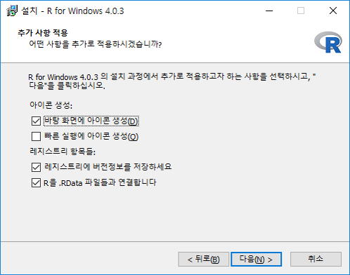

# R과 RStudio설치


## R에 필요한 컴퓨터 사양

```{r rlogo, echo=FALSE, out.width = '10%', fig.align = "left"}
knitr::include_graphics("img/rlogo.jpg")
```

다음은 R프로그램의 권장 컴퓨터 사양이다. 

* 윈도우 10
* 64비트 컴퓨터
* 8GB 램(RAM) 
* 영문 컴퓨터명 
* 영문 폴더명: R사용시 쓰는 데이타 폴더들


프로그램에 최적화된 컴퓨터는 튜닝이 잘된 자동차와 같다.^['효율적인 R프로그래밍'의 저자 콜린(영국 뉴캐슬대)과 로빈(영국 리즈 교통연구소). Colin, G., Robin. L. (2016). Efficient R programming(Online version). Sebastopol: O’Reilly. <https://csgillespie.github.io/efficientR/hardware.html>] R은 윈도우 뿐만 대부분의 운영체제(operating system)에서 잘 돌아간다. 그래서 맥(Mac), 리눅스(Linux)에서도 설치가능하다. 다만 우리나라 초중고 피시가 거의 다 윈도우로 깔려 있어서 윈도우10로 안내했다. 아직까지 학교에서 맥이나 리눅스 운영체제를 본 적이 없다. 참고로 맥계열 노트북 컴퓨터는 윈도우 IBM 노트북보다 보통 2배 이상 비싸다. 


램(RAM)은 8GB이상 권장하는데 4GB이상 램에서도 R이 돌아가긴 한다. 필자학교 영어실에 있는 데스크탑은 10년넘은 *컴인데도 R이 돌아간다. 그래도 램은 다다익선(多多益善)이다.램용량이 크면 R의 데이타처리 용량도 커져 다다익램은 이래저래 가성비가 높다. 영문 컴퓨터명과 영문 폴더명을 요구하는 이유는 R이 영어권에서 개발됐기 때문이다. 무료 소프트웨어라 이런 세세한 점까지 신경을 쓰지 못한다. 여하튼  폴더명이 한글로 돼 있으면 저장하는 순간 에러 메시지가 튀어나올 수 있다. 프로그램이 무료이니까 이정도 불편은 참아주자, 질끈! 


## 컴퓨터 사양 확인하는 법

이제 여러분의 컴퓨터의 사양을 확인해 보자. 다음방법으로 순서대로 따라가면 된다. 

```{r windowlogo, echo=FALSE, fig.cap="윈도우로고", out.width = '5%', fig.align = "left"}

```

1. 윈도우모양 : 화면 왼쪽 하단끝 아이콘 
1. 톱니바퀴 모양  
1. 윈도우 설정에서 시스템  
1. 왼쪽하단의 정보탭 
1. 장치사양의 시스템종류(ex: 64비트 운영체제) 
1. Windows사양의 에디션(ex: Windows 10 Education)


## 컴퓨터명을 영문으로 바꾸기


**컴퓨터명**이 한글로 됐을때 다음과 같이 수정하자. R을 독학으로 배운 사용자들은 대부분 한글 컴퓨터명때문에 애를 먹은 경험이 있다. 일종의 R입문 신고식이다. 한글로 된 컴퓨터 사용자명과 폴더이름때문에 R이 예기치 않은 문제를 일으킬 때가 있다.^[노성진. (2020). 비대면 교육을 위한 RStudio Cloud 및 수자원 관련 R 패키지의 소개. 한국수자원학회, Volume 53 Issue 7, pp. 98-107.] 


'디바이스 이름'이라고 하는 컴퓨터명이 한글로 돼 있으면 *이 PC의 이름 바꾸기*를 클릭하여 영문으로 컴퓨터명을 변경하자. 윈도우 버전에 따라 컴퓨터명 위치와 명칭이 조금 다를 수가 있다. 컴퓨터를 쓰다가 에러가 났을 때 대처하는 태도를 보면 컴퓨터 고수인지 아닌지 어느정도 알 수 있다. 


하수인 경우 에러메시지가 뜨면 멘탈까지 심하게 흔들린다. 필자도 경험해 봐서 잘 안다. 반면 고수들은 에러가 뜰때 차분하게 에러 메시지를 읽는다. R연수 중 보조강사로 도와줬던 학부 학생들이 에러가 떴을때 차분히 영문 에러 메시지를 읽는 모습을 보고 놀란 적이 있다. 영어실력이 그리 높아 보이지 않았던 학부생들이었는데도 말이다. 영문 에러메시지에 당황하는게 영어실력만의 문제는 아니었던 것이다. 내 노안도 한목 단단히 한 것 같다.   


## 폴더명을 한글로 바꾸기


## R 설치 


드디어 R을 설치할 시간이다! 그림과 같이 순서대로 설치하자. 

1. R 홈페이지<http://r-project.org>로 들어가서 왼쪽 위의 Download 밑에 있는 CRAN버튼을 클릭한다. 

```{r echo=FALSE, fig.cap="R설치 1번", out.width = '80%', fig.align = "center"}
knitr::include_graphics("img/install_r1.png")
```

2.  CRAN Mirrors창에서 화면을 내려 Korea 를 찾는다. Korea 밑에 4개의 사이트가 있다. 여기서 자신의 지역과 가까운 사이트를 클릭하면 된다. 부경대(Pukyong National University)는 부산에 있고, 영남대(Yeungnam University)는 대구에 있고, 서울대학교(Seoul National University)는 서울이고, 울산과학기술원(UNIST)은 울산소재이다. 

```{r echo=FALSE, fig.cap="R설치 2번", out.width = '80%', fig.align = "center"}
knitr::include_graphics("img/install_r2.png")
```


3. Download and Install R에서 세번째인 Download R for Windows을 클릭한다. 

```{r echo=FALSE, fig.cap="R설치 3번", out.width = '80%', fig.align = "center"}

```

4. R for Windows 에서 base를 클릭한다. install R for the first time를 클릭해도 된다. 

```{r echo=FALSE, fig.cap="R설치 4번", out.width = '80%', fig.align = "center"}
knitr::include_graphics("img/install_r4.png")
```


5. Download R 4.1.0 for Windows 를 클릭하면 화면 왼쪽 아래에서 파일이 저장된다.  

```{r echo=FALSE, fig.cap="R설치 5번", out.width = '10%', fig.align = "left"}
knitr::include_graphics("img/install_r5.png")
```


6. 설치 언어 선택을 물어보면 확인을 선택한다. 

```{r echo=FALSE, fig.cap="R설치 6번", out.width = '60%', fig.align = "center"}

```


7. 프로그램 저작권에 대한 부분이 나오면 다음을 클릭한다.
```{r echo=FALSE, fig.cap="R설치 7번", out.width = '80%', fig.align = "center"}
knitr::include_graphics("img/install_r7.png")
```


8. 설치할 위치선택을 물어보면 다음을 누르면 된다. 
```{r echo=FALSE, fig.cap="R설치 8번", out.width = '80%', fig.align = "center"}
knitr::include_graphics("img/install_r8.png")
```


9. 설치시작에서 다음을 누른다.
```{r echo=FALSE, fig.cap="R설치 9번", out.width = '80%', fig.align = "center"}
knitr::include_graphics("img/install_r9.png")
```


10. 구성 요소 설치에서 모두 다 선택한다. 
```{r echo=FALSE, fig.cap="R설치 10번", out.width = '80%', fig.align = "center"}
knitr::include_graphics("img/install_r10.png")
```


11. 스타트업 옵션 No(기본값)이 뜨면 다음을 선택한다. 
```{r echo=FALSE, fig.cap="R설치 11번", out.width = '80%', fig.align = "center"}

```


12. 시작 메뉴 폴더 선택에서 다음을 클릭하다. 
```{r echo=FALSE, fig.cap="R설치 12번", out.width = '80%', fig.align = "center"}

```


13. 추가 사항 적용에서 다음과 같이 3가지를 선택하고 다음을 누른다.
```{r echo=FALSE, fig.cap="R설치 13번", out.width = '80%', fig.align = "center"}
knitr::include_graphics("img/install_r13.png")
```


14. 설치 중- 설치완료
```{r echo=FALSE, fig.cap="R설치 14번", out.width = '70%', fig.align = "center"}
knitr::include_graphics("img/install_r14.png")
```


```{r echo=FALSE, fig.cap="R설치 15번", out.width = '20%', fig.align = "left"}
knitr::include_graphics("img/install_r15.png")
```


"혹시 왜 윈도우 운영체제 설치만 예시하는가?"라고 항의하실 선생님이 게실지 몰라 한 마디 보텐다. 국내 R사용자의 95% 이상이 윈도우 운영체제를 사용하기 때문이다.^[한국데이타산업진흥원. (2013). *가장 많이 받는 R관련 기술적 질문.* <https://dataonair.or.kr/db-tech-reference/d-story/data-story/?mod=document&uid=63131>] 


한편, 설치하다가 혹 5단계애서 '다음' 누르기를 주저하는 독자가 있을지 모르겠다. 한국어로 설치해도 되는 이유는 여기서 언어선택이 설치 중 표시언어와 관련있기 때문이다. 여기서 영문을 선택한다고 R이 영문으로 설치되지는 않는다. 원하면 R실치 후 영문버전으로 바꾸는 방법이 있다. 그러나 굳이 그런 필요는 없다. R을 쓸때 R보다는 RStudio에서 작업하기 때문이다. 


프로그램이 영문버전이냐 한글버전이냐를 따지는 이유는  2가지다. 먼저 에러메시지를 영문으로 받으면 구글링할때 보다 많은 자료를 찾을 수 있다. 그 예로 영문 에러메시지로 구글에서 검색해야 스택오버플로우(stackOverflow)의 Q&A가 뜬다. 스택오버플로우는 세계 각국 R사용자들이 에러에 대한 질문과 답을 올리는 월드 클래스의 정보교환장이다. 두번째 이유는 한글메뉴보다 영문메뉴가 쓰기 편하다는 것이다. 구글링했을때 해당 메뉴를 찾기도 영문버전이 한글버전보다 찾기 쉽다.    


7단계에서 혹자는 기본 설치폴더에 설치하지 않고 별도의 R폴더를 만들어 쓰는 사용자도 있다. Program Files에 공백이 있어, 에러가 날 수 있다고 말한다. 그런데 필자는 지난 4년 넘게 R이 정해주는 대로 Program Files에서 저장해 썼는데 문제가 없었다. 


## RStudio 설치
R프로그램을 설치했다면 이제 RStudio를 그림과 같이 순서대로 설치하자. 

1. RStudio 홈페이지<https://www.rstudio.com/>로 들어가자. 
```{r echo=FALSE, out.width = '80%', fig.align = "center"}

```


2. Choose Your Version화면 왼쪽 첫번째 RStudio Desktop의 Open Source License, Free에서 DOWNLOAD를 클릭한다.   
```{r echo=FALSE, out.width = '80%', fig.align = "center"}
knitr::include_graphics("img/install_rs2.png")
```


3. 파란색배경의 Download RSTUDIO FOR WINDOWNS 버튼을 클릭한다.

```{r echo=FALSE, out.width = '80%', fig.align = "center"}

```


4. 화면 왼쪽 아래에서 다운로드된 설치파일 아이콘을 클릭한다. 

```{r echo=FALSE, out.width = '10%', fig.align = "left"}

```


5. 'RStudio 설치를 시작합니다' 화면에서 다음을 누른다.

```{r echo=FALSE, out.width = '80%', fig.align = "center"}

```


6. 설치할 위치선택을 물어보면 다음을 누르면 된다. 
```{r echo=FALSE, out.width = '40%', fig.align = "left"}

```


```{r echo=FALSE, out.width = '40%', fig.align = "left"}

```


7. 완료 버튼을 누른다. 

```{r echo=FALSE, out.width = '80%', fig.align = "center"}
knitr::include_graphics("img/install_rs8.png")
```


*"R프로그램 설치하며 됐지, 왜 RStudio를 설치하느냐? R이 방송도 아닌데, 스튜디오가 필요하냐?"*


R사용자 중 R프로그램만 사용하는 사람은 거의 없다. 데이타분석 교육기관인 플렛아언스쿨(2021)에 따르면 대다수의 R사용자는 RStudio로 코딩을 한다. R을 처음 배울때 필자도 RStudio를 왜 깔아야 하는지 이해를 못했다. 설치해야 한다고 해서 그냥 깔았다. 그리고 RStudio를 쓰면서 사람들이 왜 R을 쓰지 않고 RStudio를 사용하는지 조금씩 이해하게 됐다.   


비유하지만 이렇다. 학교에서 선생님들께 유행처럼 노트북 컴퓨터가 지급됐다. 그런데 언제부턴가 노트북이 자판도 불편하고 화면도 작아 별도의 키보드를 연결하고, 20인치짜리 큰 모니터를 듀얼로 연결해 쓴다. 노트북이 R프로그램이라면 RStudio는 노트북에 연결한 키보드와 모니터다.

여기서 R의 비싼 용어 하나 추가! 


RStudio를 통합개발환경(Integrated Development Environment: 이하 IDE)이라 부른다. RStudio는 전세계 R사용자들에게 가장 인기있는 IDE다.


